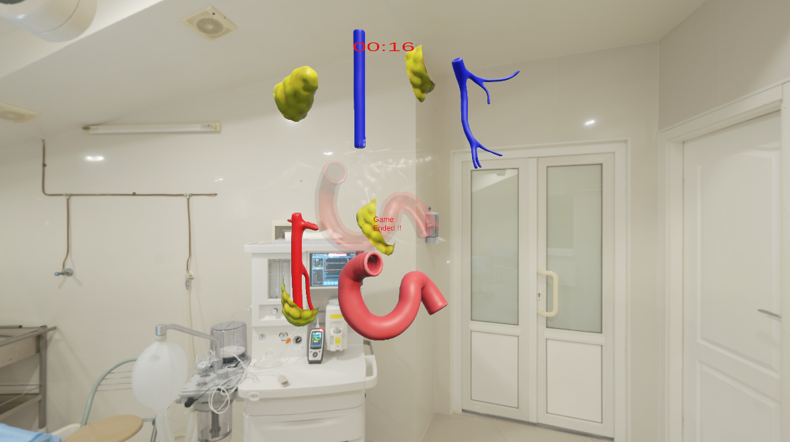

<p align="center">
  <a href="" rel="noopener">
    


</p>
<p align="center">
    <br> 
</p>
<div align="center">

[](https://github.com/hamdy-cufe-eng/3D-Organ-Puzzle-Game/contributors)
[](https://github.com/hamdy-cufe-eng/3D-Organ-Puzzle-Game/issues)
[](https://github.com/hamdy-cufe-eng/3D-Organ-Puzzle-Game/network)
[](https://github.com/hamdy-cufe-eng/3D-Organ-Puzzle-Game/stargazers)
[](https://github.com/hamdy-cufe-eng/3D-Organ-Puzzle-Game/blob/main/LICENSE)

</div>

<details>
  <summary>Table of Contents</summary>
  <ol>
    <li>
      <a href="#about">About The Project</a>
      <ul>
        <li><a href="#tech">Built Using</a></li>
      </ul>
    </li>
    <li>
      <a href="#install">Getting Started</a>
      <ul>
        <li><a href="#install">Installation</a></li>
      </ul>
    </li>
    <li><a href="#start">How to start</a></li>
    <li><a href="#features">Features</a></li>
    <li><a href="#screenshots">Screenshots</a></li>
	<li><a href="#contributors">Contributors</a></li>
  </ol>
</details>


## About

 Advanced 3D Puzzle Game  with multiple features, 
 Timer for end game , main menu and much more !.

## 💻 Built Using <a name = "tech"></a>
* 
* 


## 🏁 Get Started /Installation <a name = "install"></a>
1. **Clone the repository**
```
git clone https://github.com/hamdy-cufe-eng/3D-Organ-Puzzle-Game.git
```
2. **Install Visual Studio && Unity**


3. **Open the Unity Project**

4. **Build the project**

5. **You can run through**


## 📌 How to use <a name = "start"></a>

### Usage :
- After compiling the C# project , try to load the unity project
- You can use blender or so for cutting objects
- apply the edited model to **Unity**

## 🎆 Features <a name = "features"></a>

- Main Menu
- Interactive sounds
- Ability to randomize of puzzle objects
- Applying rotation in Z-Plane (**Using 'Q' , 'E'**)
- Timer which decides whether the puzzle is totally snapped before time ending
- Snapping of objects ( **Using vector displacment for checking distance**)

## 📷 Screenshots <a name = "screenshots" ></a>

<div name="Screenshots" align="center">
   
   <hr>
    
    <hr>
  
   
   <hr>
     
   <hr>
</div>

## Contributors <a name = "contributors"></a>
<table align="center">
  <tr>
    <td align="center">
    <a href="https://github.com/hamdy-cufe-eng" target="_black">
    
    <br />
    <sub><b>Hamdy Ahmed</b></sub></a>
    </td>
    <td align="center">
    <a href="https://github.com/Karim-Mohamed-Elsayed" target="_black">
    
    <br />
    <sub><b>Karim Mohamed</b></sub></a>
    </td>
     <td align="center">
    <a href="https://github.com/David-Amir-18" target="_black">
    
    <br />
    <sub><b>David Amir</b></sub></a>
    </td>
    
  </tr>
 </table>
